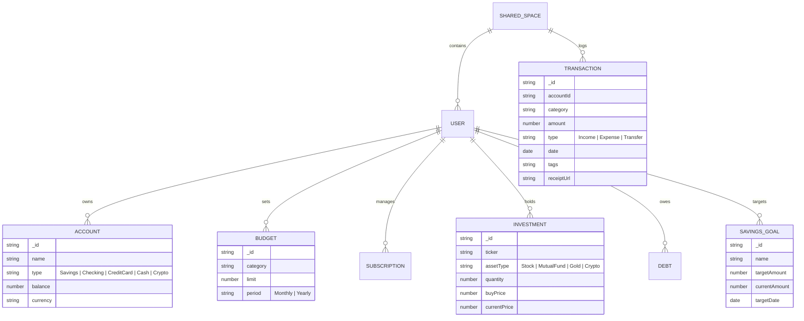
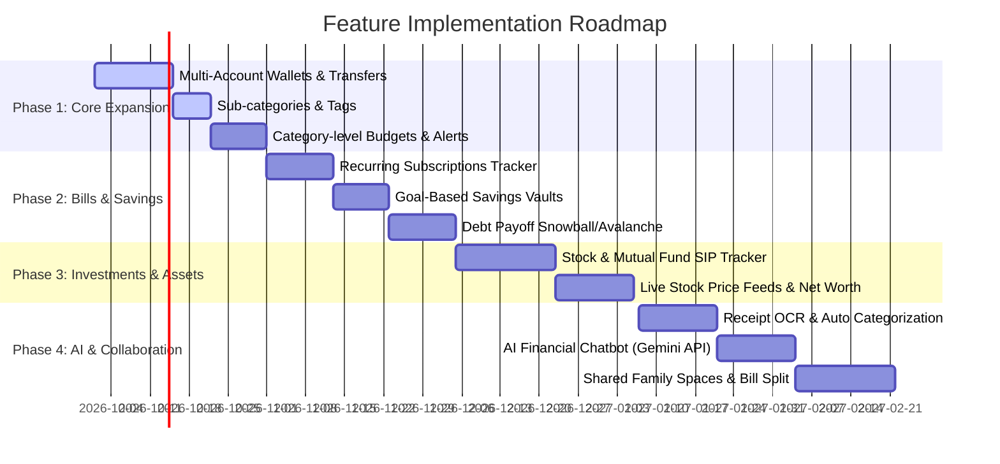

# 🚀 Comprehensive Feature Expansion Roadmap & Architecture Plan

This document outlines a feature blueprint for transforming the **Expense Tracker** into a personal finance ecosystem. It covers basic, intermediate, and advanced financial management capabilities including multi-source account tracking, investment portfolios, automated budgeting, AI financial insights, and shared family finances.

---

## 📋 Executive Overview & Core Objectives

| Module | Objective | Key Highlights |
| :--- | :--- | :--- |
| **1. Multi-Source Banking & Wallets** | Track money across multiple real-world locations | Savings, Checking, Credit Cards, Cash, Crypto Wallets |
| **2. Investment & Asset Tracking** | Aggregate net worth & portfolio performance | Stocks, Mutual Funds, SIPs, Real Estate, XIRR/CAGR metrics |
| **3. Smart Budgeting & Subscriptions** | Proactive expense control & automated bills | 50/30/20 envelopes, Subscription renewal alerts |
| **4. AI Financial Intelligence** | Predictive analytics & automated receipt parsing | Receipt OCR, Cash Flow Forecasting, Anomaly Detection |
| **5. Shared & Family Finance** | Group accounting & bill splitting | Joint spaces, Splitwise-style balances, Export reports |
| **6. Security & PWA Capabilities** | Bank-grade security & offline-first usage | Biometric Passkeys, AES-256 encryption, PWA Offline sync |

---

## 🏦 1. Multi-Source Income, Banking & Wallet Management

### 1.1 Multi-Account Aggregation
* **Account Types**:
  * **Bank Accounts**: Savings, Checking, Salary Accounts.
  * **Credit Cards**: Track credit limit, current billable balance, statement dates, and minimum due.
  * **Cash & Digital Wallets**: Physical Cash, Paytm, PayPal, Apple Pay.
  * **Crypto & Web3 Wallets**: Bitcoin, Ethereum, Cold storage balance.
* **Inter-Account Transfers**:
  * Ability to record transfers between accounts (e.g., *Bank Account A $\rightarrow$ Savings Account B* or *Bank Account $\rightarrow$ Credit Card Bill Payment*) **without** incorrectly counting the transfer as an expense or new income.

### 1.2 Multi-Currency & FX Exchange Rates
* Support multi-currency transactions for international users, remote freelancers, and travelers.
* Real-time currency conversion using free APIs (e.g., ExchangeRate-API or OpenExchangeRates) with historical rates.
* Base currency preference in user profile with automatic dashboard normalization.

### 1.3 Income Streams & Classification
* **Categorization**: Salary, Freelance, Dividends, Rental Income, Interest, Crypto Gains, Refunds, Side Hustles.
* **Recurring Income Engine**: Auto-log monthly salary or weekly client retainers.

---

## 📈 2. Investment Portfolio & Net Worth Tracker

### 2.1 Asset & Investment Aggregation
* **Equity & Mutual Funds**:
  * Log stock purchases (Ticker, Quantity, Buy Price, Date, Brokerage).
  * SIP (Systematic Investment Plan) scheduler & auto-tracker.
  * Live price feeds for Indian (NSE/BSE) and US (NASDAQ/NYSE) equities via Yahoo Finance / AlphaVantage APIs.
* **Fixed Income & Commodities**:
  * Fixed Deposits (FD), Recurring Deposits (RD), Public Provident Fund (PPF), Sovereign Gold Bonds (SGB), Physical Gold.
* **Real Estate & Physical Assets**:
  * Property value estimator, vehicle depreciation tracker, jewelry value.

### 2.2 Performance Metrics & Net Worth Calculation
* **Net Worth Dashboard Widget**:
  $$\text{Net Worth} = \text{Total Assets} - \text{Total Liabilities (Credit Cards, Loans)}$$
* **Investment Performance Metrics**:
  * Realized vs. Unrealized Gains/Losses.
  * Extended Internal Rate of Return (**XIRR**) and Compound Annual Growth Rate (**CAGR**).
  * Dividend yield & passive income tracking.

### 2.3 Goal-Based Savings Vaults
* Create targeted savings goals (e.g., *Emergency Fund - 6 Months*, *New Car*, *Vacation*, *House Down Payment*).
* Visual progress bars with estimated completion date based on current monthly savings rate.
* Auto-allocate a percentage of monthly net income to savings vaults.

---

## 💡 3. Smart Budgeting, Bills & Debt Management

### 3.1 Advanced Budgeting Rules
* **Budget Allocations**:
  * **Category-level Budgets**: Set monthly limits per category (e.g., Dining out: ₹5,000, Shopping: ₹8,000).
  * **50/30/20 Rule Helper**: Auto-calculate allocation into *Needs (50%)*, *Wants (30%)*, and *Savings/Debt (20%)*.
  * **Rollover Budgets**: Unused budget amounts automatically roll over to the next month.
* **Proactive Notifications**:
  * Threshold alerts at 50%, 80%, and 100% of budget limit via In-App Toast, Email, or Web Push notifications.

### 3.2 Subscriptions & Fixed Bill Calendar
* **Subscription Management**:
  * Track recurring SaaS & entertainment subscriptions (Netflix, Spotify, AWS, Gym, iCloud).
  * Countdown timer for upcoming renewal dates.
  * "Unused Subscription Finder" highlighting recurring charges with zero recent activity.
* **Calendar View**:
  * Interactive monthly calendar showing income payday, bill due dates, and major planned expenses.

### 3.3 Debt & Loan Payoff Tracker
* **Loan Aggregator**: Track Mortgages, Car Loans, Student Loans, Personal Loans.
* **Payoff Strategies**:
  * **Debt Snowball**: Pay off smallest balance first for psychological quick wins.
  * **Debt Avalanche**: Pay off highest interest rate debt first to minimize total interest paid.
* Interest cost calculator & extra payment simulator.

---

## 🤖 4. AI-Powered Financial Intelligence & Automation

### 4.1 Receipt OCR & Intelligent Parsing
* Drag-and-drop receipt scanning using Tesseract OCR or Gemini Vision API.
* Auto-extracts: **Merchant Name**, **Transaction Date**, **Total Amount**, **Tax/VAT**, and auto-suggests Category based on merchant name (e.g., *Starbucks $\rightarrow$ Food & Dining*).

### 4.2 AI Financial Assistant (Gemini / OpenAI Integration)
* **Natural Language Queries**:
  * *"How much did I spend on food last weekend compared to last month?"*
  * *"Can I afford a ₹45,000 vacation next month?"*
* **Spending Anomaly Detection**:
  * Flags unusual transactions (e.g., *"You spent 150% more on Transport this week than your average"*).
* **Smart Cost-Cutting Recommendations**:
  * Identifies patterns and suggests actionable ways to save.

### 4.3 Predictive Cashflow Forecasting
* ML/Statistical model analyzing historic income and spend patterns to forecast:
  * Expected bank balance at the end of the month.
  * Danger zones where cash reserves might run low before payday.

---

## 👥 5. Shared Spaces, Bill Splitting & Reporting

### 5.1 Shared Workspaces & Family Finances
* **Multi-User Spaces**: Create shared ledgers for Households, Couples, or Roommates.
* **Role-Based Access Control (RBAC)**:
  * **Admin**: Manage users, edit all transactions.
  * **Contributor**: Add income/expenses, view reports.
  * **Viewer**: Read-only access (great for financial advisors or dependents).

### 5.2 Splitwise-Style Expense Splitting
* Split transactions among group members by **Equal Percentages**, **Exact Amounts**, or **Shares**.
* Auto-calculate "Who owes Whom" and simplified debt settlement options.

### 5.3 Advanced Exporting & Reporting Engine
* Export custom PDF Financial Reports with visually appealing charts, breakdown tables, and executive summaries.
* Custom CSV & Excel exports with date range filtering and category tags.

---

## 🔒 6. Security, Privacy & PWA Experience

* **Biometric & Passkey Support**: Login via Fingerprint / FaceID using WebAuthn standard.
* **End-to-End Data Security**: AES-256 encryption for financial account details and sensitive balances.
* **Progressive Web App (PWA)**:
  * Full offline support using Service Workers & IndexedDB.
  * Add to Home Screen on iOS/Android/Windows.
  * Automatic background sync once connection is restored.

---

## 🏗️ 7. Target Database Schema Architecture

Here is the proposed MongoDB / Mongoose schema structure to support these advanced capabilities:

---

## 🗓️ 8. Phased Implementation Roadmap

---

### Key Technical Stack Recommendations for New Features:
* **Charts & Analytics**: Recharts / Chart.js for financial trend graphs.
* **OCR / Vision**: Tesseract.js / Google Gemini 1.5 Flash Vision API.
* **Stock API**: Yahoo Finance API / AlphaVantage / CoinGecko API.
* **PDF Export**: `@react-pdf/renderer` or `jspdf` + `html2canvas`.
* **PWA Engine**: `vite-plugin-pwa` with Workbox offline cache.
